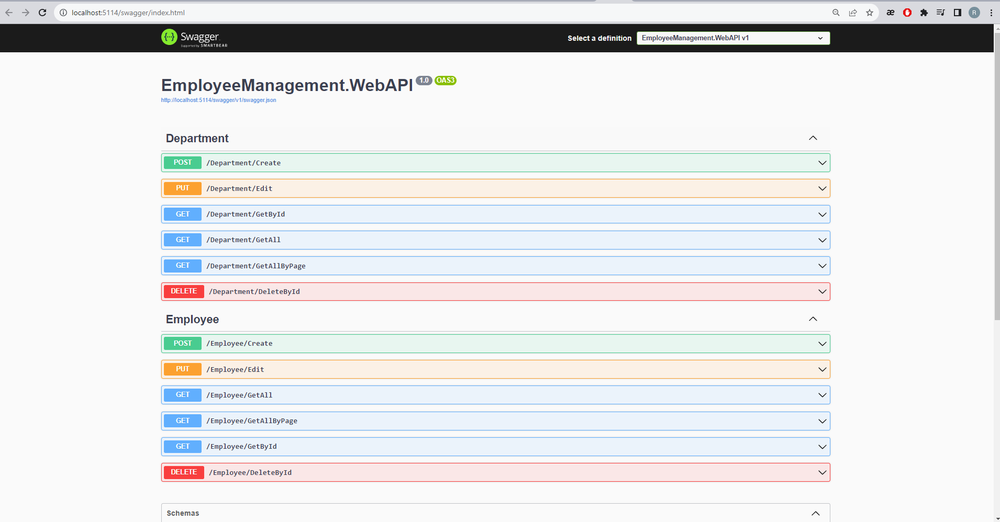

# EmployeeManagement

This project is contains basic CRUD API'es for manage Employees and Departments.

In this project, I demonstrated Onion Architecture and UnitOfWork pattern with Generic Repository pattern.

## Used technologies
- .NET 6.0
- ASP.NET Core 6.0
- Entity Framework Core 6.0.21
  - MsSQL database
- Mapster 7.3.0 for auto mapping. (The Mapster is faster than the AutoMapper)

## Configuration

First you need to create a database.

For this purpose, you must run the command below with CMD or PowerShell inside the ```..\EmployeeManagement\Presentation\EmployeeManagement.WebAPI``` directory :

```
dotnet ef database update
```

You can also change the ```Data source``` in appsettings.json file

```
"ConnectionStrings": {
    "EmployeeManagement": "Data source=.; Initial Catalog=EmployeeManagement; Integrated Security=true;"
},
```

## How to run the projet ?

Firstly, you need .NET SDK 6.0 or ASP.NET Core Runtime 6.0 for run the project.

After, you can run the command below with CMD or PowerShell inside the ```..\EmployeeManagement\Presentation\EmployeeManagement.WebAPI``` directory :

```
dotnet run
``` 

Project will run the ``5114`` port. (You can also change it in ```..\Properties\launchSettings.json``` file)

## Usage

After ```dotnet run``` you can the visit ```http://localhost:5114/swagger/index.html``` and call the some API.




You can also use any rest client for this purpose. For example you can also use the `Postman`
